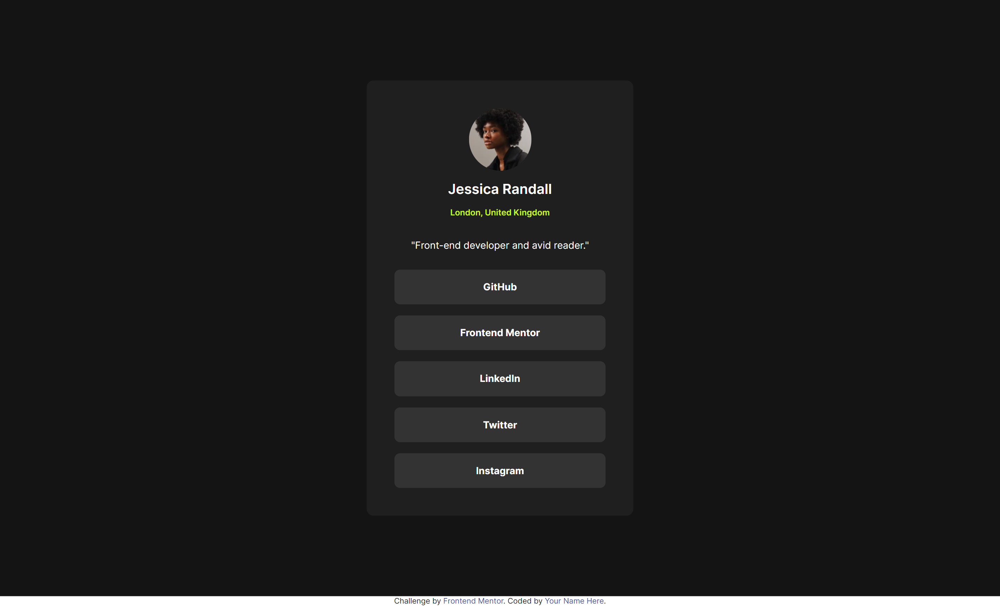
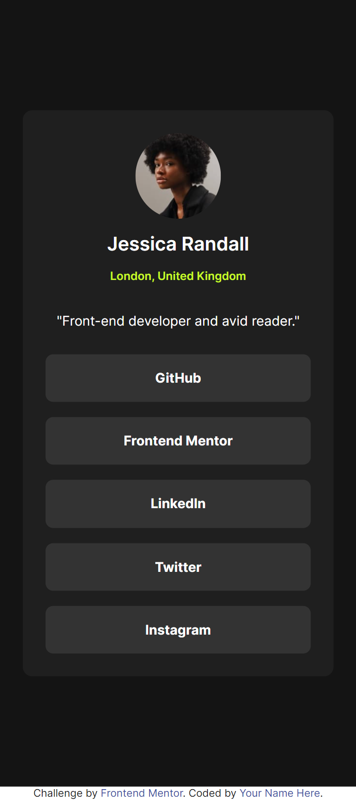

# Frontend Mentor - Social links profile solution

This is a solution to the [Social links profile challenge on Frontend Mentor](https://www.frontendmentor.io/challenges/social-links-profile-UG32l9m6dQ). Frontend Mentor challenges help you improve your coding skills by building realistic projects. 

## Table of contents

- [Overview](#overview)
  - [The challenge](#the-challenge)
  - [Screenshot](#screenshot)
- [My process](#my-process)
  - [Built with](#built-with)
  - [What I learned](#what-i-learned)
  - [Continued development](#continued-development)
- [Author](#author)


## Overview

### The challenge

Users should be able to:

- See hover and focus states for all interactive elements on the page

### Screenshot




## My process

### Built with

- HTML and SCSS
- Mobile-first workflow
- Webstorm with pre-built server and File Watcher with SCSS for building CSS


### What I learned

- fit image to circle
```css
  container {
  border-radius: 50%;
  overflow: hidden;

  img {
    height: 100%;
    width: 100%;
    object-fit: cover;
  }
}
```
- Buttons: when a button links to a website, then use anchor links and style them as buttons
```html
<a href="#" class="btn">I am a Button to #</a>
```

- create a list of things:
```css
item {
  display: block;
}

```
- do not forget the syntax for "ALL BUT LAST":
```css
  :not(:last-child) {}
```


### Continued development

My screenshot have a lot of white space under the content. How can I get rid of it? Do I have to?

## Author

- Github - [Sonja Krafft](https://www.github.com/sonmikrafft)
- Frontend Mentor - [@sonmikrafft](https://www.frontendmentor.io/profile/sonmikrafft)